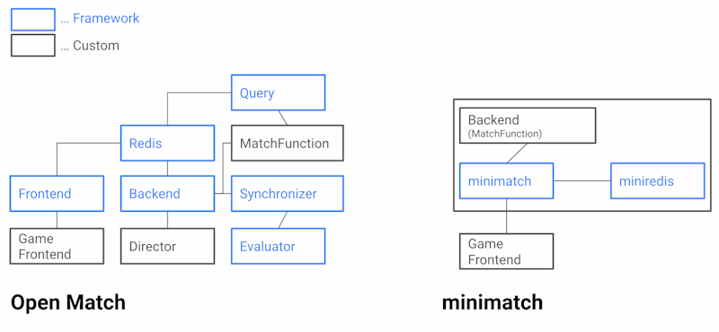

# minimatch
Minimal [Open Match](https://open-match.dev/) replacement for small development environment.

🚧 **WIP: This project is incomplete and should not be used in production.**

## Why minimatch?



[Open Match](https://open-match.dev/) is a good solution for scalable matchmaking, but its scalability complicates the architecture.
It is not essential for game developers to learn Kubernetes or distributed systems to develop matchmaking logic.

And complex architectures are not needed for local development and testing of logic. Sometimes you will want a small Open Match.

**minimatch** solves the above problem.
It runs in a single process; there are no dependencies other than Go!

## Features

- [x] Open Match compatible Frontend Service (gRPC only)
  - [x] Create/Get/Watch/Delete ticket
  - [ ] Backfill
- [x] Run match functions and propose matches
- [ ] Evaluator

## Quickstart

minimatch consists of two parts: Backend and Frontend.
You can pass the **MatchProfile**,
**MatchFunction** and **Assigner** to the minimatch backend.

**MatchFunction** performs matchmaking based on Ticket for each fetched pool.
And **Assigner** assigns a GameServer info to the established matches.

After registering Backend, start the Frontend service as a gRPC server.
You can now use Open Match compatible services!

```go
var matchProfile = &pb.MatchProfile{...}

func MakeMatches(profile *pb.MatchProfile, poolTickets minimatch.PoolTickets) ([]*pb.Match, error) {
	// Matchmaking logic here
}

func AssignGameServer(ctx context.Context, matches []*pb.Match) ([]*pb.AssignmentGroup, error) {
	// Assign gameservers here
}

func main() {
    // Create minimatch instance with miniredis
    mm, _ := minimatch.NewMiniMatchWithRedis()

    // Add backend (Match Profile, Match Function and Assigner)
    mm.AddBackend(matchProfile, minimatch.MatchFunctionFunc(MakeMatches), minimatch.AssignerFunc(AssignGameServer))

    // Start minimatch backend service with Director's interval
    go func() { mm.StartBackend(context.Background(), 1*time.Second) }()

    // Start minimatch frontend service
    mm.StartFrontend(":50504")
}
```

See [examples](./examples) for more concrete examples.

## Usecase

### Integration tests for matchmaking

Minimatch has Open Match Frontend compatible services.
Therefore, it can be used for integration testing of matchmaking and 
can be tested with the same interface as Open Match without Kubernetes.

```go
package xxx_test

import (
  "context"
  "testing"

  "github.com/castaneai/minimatch"
  "github.com/stretchr/testify/assert"
  "github.com/stretchr/testify/require"
  "open-match.dev/open-match/pkg/pb"
)

var anyProfile = &pb.MatchProfile{
  Name: "test-profile",
  Pools: []*pb.Pool{
    {Name: "test-pool"},
  },
}

func TestSimpleMatch(t *testing.T) {
	s := minimatch.RunTestServer(t, anyProfile, minimatch.MatchFunctionFunc(MakeMatches), minimatch.AssignerFunc(AssignGameServer))
	c := s.DialFrontend(t)
	ctx := context.Background()

	t1 := mustCreateTicket(ctx, t, c, &pb.Ticket{})
	t2 := mustCreateTicket(ctx, t, c, &pb.Ticket{})

	// Trigger director's tick
	require.NoError(t, s.TickBackend())

	as1 := mustAssignment(ctx, t, c, t1.Id)
	as2 := mustAssignment(ctx, t, c, t2.Id)

	assert.Equal(t, as1.Connection, as2.Connection)
}

func mustCreateTicket(ctx context.Context, t *testing.T, c pb.FrontendServiceClient, ticket *pb.Ticket) *pb.Ticket {
  t.Helper()
  resp, err := c.CreateTicket(ctx, &pb.CreateTicketRequest{Ticket: ticket})
  require.NoError(t, err)
  require.NotEmpty(t, resp.Id)
  require.NotNil(t, resp.CreateTime)
  return resp
}

func mustAssignment(ctx context.Context, t *testing.T, c pb.FrontendServiceClient, ticketID string) *pb.Assignment {
  t.Helper()
  resp, err := c.GetTicket(ctx, &pb.GetTicketRequest{TicketId: ticketID})
  require.NoError(t, err)
  require.NotNil(t, resp.Assignment)
  return resp.Assignment
}

```


## Examples

- [Simple 1vs1 matchmaking server](./examples/simple1vs1/simple1vs1.go)
