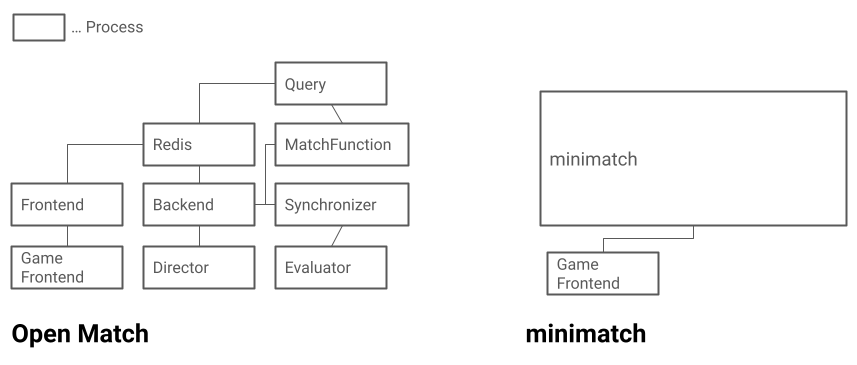

# minimatch

Minimal [Open Match](https://open-match.dev/) replacement.

[](https://deepwiki.com/castaneai/minimatch)

## Why minimatch?



[Open Match](https://open-match.dev/) is a good solution for scalable matchmaking, but its scalability complicates the architecture.
Most of us are game developers, not Kubernetes experts.

**minimatch** provides an API compatible with Open Match, but runs entirely in a single Go process. No Kubernetes required. 
It's also [highly scalable](./docs/scalable.md) by offloading state to Redis,
making it suitable for everything from local development to full-scale production.

## Features

- [x] Open Match compatible Frontend Service (gRPC, gRPC-Web and [Connect](https://connectrpc.com/docs/protocol/))
  - [x] Create/Get/Watch/Delete ticket
  - [ ] Backfill
- [x] Run match functions and propose matches
- [x] Evaluator

## Quickstart

minimatch consists of two parts: **Frontend** and **Backend**.

Frontend is an API Server for creating tickets and checking matchmaking status.

Backend is a job to retrieve tickets and perform matchmaking.
You can pass the **MatchProfile**,
**MatchFunction** and **Assigner** to the backend.

**MatchProfile** is the definition of matchmaking. It has pools for classifying tickets.
**MatchFunction** performs matchmaking based on Ticket for each fetched pool.
And **Assigner** assigns a GameServer info to the established matches.

The following is a minimal code. See [examples/](./examples) for a more actual example.

## Use case

### Testing matchmaking logic

Minimatch has Open Match Frontend compatible services.
Therefore, it can be used for testing of matchmaking logic without Kubernetes.

minimatch has a helper function `RunTestServer` making it easy to write matchmaking tests.
See [examples/integration_test](./examples/integration_test/integration_test.go) for more specific examples.

```go
package xxx_test

import (
  "testing"

  "github.com/castaneai/minimatch"
  pb "github.com/castaneai/minimatch/gen/openmatch"
)

func TestSimpleMatch(t *testing.T) {
  s := minimatch.RunTestServer(t, map[*pb.MatchProfile]minimatch.MatchFunction{
    profile: minimatch.MatchFunctionFunc(MakeMatches),
  }, minimatch.AssignerFunc(AssignGameServer))
  frontend := s.DialFrontend(t)

  // ...
}
```

### Small development environments

When environments are separated for development and production,
you may want to reduce infrastructure costs for the development environment.

In such cases, minimatch can be installed instead of Open Match to create a minimum development environment.
minimatch has an Open Match compatible Frontend Service, so there is no need to change the API!

See [Simple 1vs1 matchmaking server](./examples/simple1vs1/simple1vs1.go) for examples.

## Differences from Open Match

minimatch is modeled after [Open Match](https://github.com/googleforgames/open-match),
but has some differences in its internal architecture.

See [Differences from Open Match](./docs/differences.md) for details.


## Scalability

Is minimatch really just a mini? No, it is not! Despite its name, minimatch has scalability.
Please see [Scalable minimatch](./docs/scalable.md).

## Consistency and performance

Please see the following docs for consistency and performance to consider in minimatch.

[Consistency and performance](./docs/consistency.md)

## Metrics 

minimatch Backend exposes metrics in OpenTelemetry format to help monitor performance.
Please see [Metrics](./docs/metrics.md) for details.
