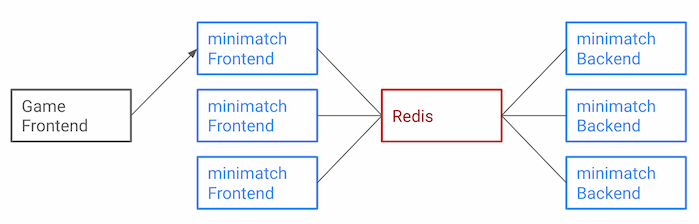
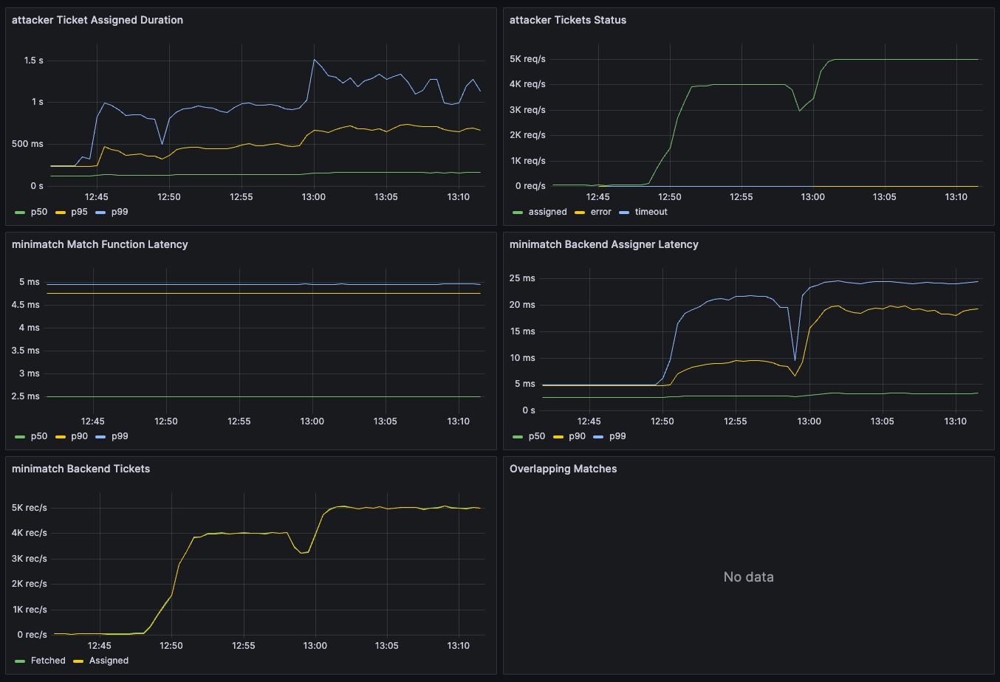

# Scalable minimatch

Is minimatch really just a mini? No, it is not!
Despite its name, minimatch has scalability.

minimatch can be configured as shown in the following figure.
Want to try it? See Helm chart: [charts/minimatch-scaled](../charts/minimatch-scaled) in a repository.



Since Frontend, Backend and Redis are separate processes, 
configure them separately without using `minimatch.NewMinimatchWithRedis`.

## Configure Redis

Use `statestore.NewRedisStore` to configure Redis by passing `rueidis.Client` and `rueidislock.Locker`.

```go
// Create a Redis client
redis, err := rueidis.NewClient(rueidis.ClientOption{
    InitAddress:  []string{"x.x.x.x:6379"},
})
// Create a Redis locker client
locker, err := rueidislock.NewClient(rueidislock.LockerOption{
    ClientOption: rueidis.ClientOption{InitAddress:  []string{"x.x.x.x:6379"}},
})
store := statestore.NewRedisStore(redis, locker)
```

## Configure Frontend

minimatch Frontend mainly provides CreateTicket and WatchAssignment APIs.
No matchmaking implementation is required here. See [Scalable frontend example](../loadtest/cmd/frontend) for an actual example.

```go
sv := grpc.NewServer()
pb.RegisterFrontendServiceServer(sv, minimatch.NewFrontendService(store))
```


## Configure Backend

minimatch Backend fetches the created Ticket and performs matchmaking.
Insert your matchmaking logic here. See [Scalable backend example](../loadtest/cmd/backend) for an actual example.

```go
matchProfile := &pb.MatchProfile{...}
matchFunction := minimatch.MatchFunctionSimple1vs1
assigner := minimatch.AssignerFunc(dummyAssign)
backend, err := minimatch.NewBackend(store, assigner)
backend.AddMatchFunction(matchProfile, matchFunction)
```

## (Optional) Splitting Redis

If Redis is the bottleneck,
Storing Ticket and Assignment on different Redis servers will result in better load balancing.

```go
redis1, err := rueidis.NewClient(...)
redis2, err := rueidis.NewClient(...)
statestore.NewRedisStore(redis1, locker, statestore.WithSeparatedAssignmentRedis(redis2))
```

## How well does it scale?

minimatch achieved 5,000 assign/s under the following conditions:

- 1vs1 simple matchmaking
- Backend tick rate: 100ms
- Kubernetes cluster: GKE Autopilot (asia-northeast1 region)
- Total vCPU: 70 (includes loadtest attacker)
- Total memory: 245GB
- Attacker replicas: 50 (CPU: 500m, Mem: 1GiB)
- Frontend replicas: 50 (CPU: 500m, Mem: 1GiB)
- Backend replicas: 10 (CPU: 500m, Mem: 1GiB)
- Redis (primary): Google Cloud Memorystore for Redis Basic tier (max capacity: 1GB)

the 50th percentile time of ticket assignment was stable at less than 170 ms.

[](./loadtest.png)

The code used for the load test is in [loadtest/](../loadtest).
